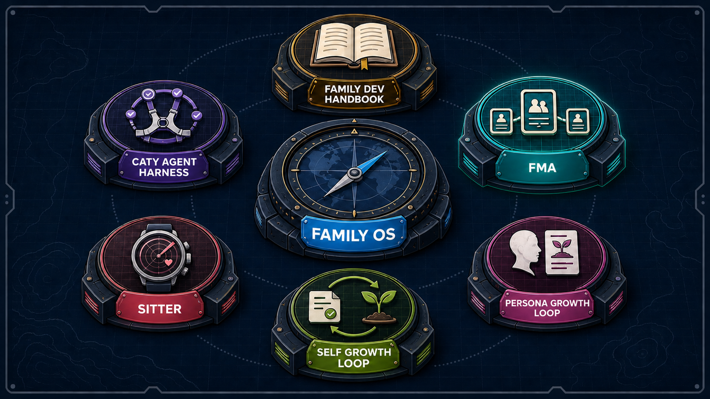
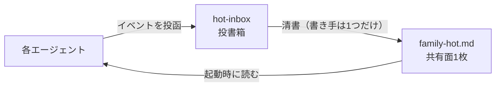

# Family Memory Architecture

<div align="center">

[🇺🇸 English](README.md) ｜ **🇯🇵 日本語** ｜ [🇨🇳 简体中文](README.zh.md) ｜ [🇹🇭 ไทย](README.th.md)



[](https://github.com/caty-ai/family-memory-architecture/actions/workflows/full-suite.yml)
[](LICENSE)


複数の AI エージェントに「共有の記憶」を持たせるための、設計・運用ルール・実装ツール一式です。<br>
別々の場所で動く AI は、こちらで決めたことをあちらが知りません。<br>
全員が読む短い共有面を1枚だけ作り、決定と現在地の登録をそこへ一本化することで、仕組みとして揃えます。

**共有するのは現在地だけ。人格は混ぜない。**

🔧 [設計の正本](docs/DESIGN.md) ｜ 📘 [導入ガイド](docs/getting-started.md)

</div>
<!-- repo-state:begin (generated; do not edit) -->
<p align="center"><sub>generation: <code>d0be42c</code> (2026-09-05T09:48:29Z) · verify: <a href="https://api.github.com/repos/caty-ai/family-memory-architecture/commits/main">API HEAD</a> · <a href="./status.json">status.json</a></sub></p>
<!-- repo-state:end -->

---

<div align="center">


</div>

---

## 目次

- [こんな経験はありませんか？](#problems)
- [できること](#what-you-get)
- [使うのに必要なもの](#requirements)
- [使いはじめる](#get-started)
- [安心して使える理由](#safety)
- [向いていないケース](#not-for-you)
- [プロジェクトの状況](#status)
- [もっと詳しく](#docs)
- [Family OS の一員です](#family-os)
- [謝辞](#acknowledgments)
- [ライセンス](#license)

---

<a id="problems"></a>

## こんな経験はありませんか？

AI エージェントを2体以上、別のマシンや別のサービスで動かしていると、次のことが起きます。

- **決定が伝わらない** — 片方の AI が決めたことを、もう片方が知らない
- **毎回説明し直す** — セッションが変わるたび、同じ前提をゼロから話す
- **どれが最新か分からない** — 同じ話題の情報が複数の場所に散らばる
- **出どころが辿れない** — 「そう聞きました」の元が誰にも分からない

この4つを、気合いではなく仕組みで潰すために作ったのがこのリポジトリです。

---

<a id="what-you-get"></a>

## できること

やることは1つだけです。全員が読む短い共有面を1枚つくり、そこへ書き込む経路を1本に絞ります。各エージェントの人格・system prompt・手元の記憶には触れません。



- 📋 **1枚に集める**

  いまチーム全員が知っておくべきこと — 誰が何を決めたか、どこまで進んでいるか — だけを、共有フォルダの Markdown 1枚にまとめます。長い議事録や設計書は元の場所に置いたままで、共有面に載るのはそこへのリンクだけです。

- 📮 **書き込みは投書箱ごし**

  エージェントは共有面を直接編集できません。イベントを1件1ファイルで投函し、清書するプログラムだけが共有面を書き換えます。だから書式が崩れず、出どころが必ず残ります。

- 🔍 **1コマンドで横断検索**

  共有面・ローカルの検索索引・クラウドの長期記憶を、`recall` という1つのコマンドでまとめて引けます。クラウドの層は外したまま使えます。

動かすのに要るものは、思っているより少ないはずです。

---

<a id="requirements"></a>

## 使うのに必要なもの

最小構成に要るのは Python 3 と空のフォルダだけです。ほかはすべて、あとから足せる任意の層です。

| 観点 | 対応 |
|---|---|
| ランタイム | ✅ Python 3.14（3.14.3 で実測）／ ⚠️ 3.13 以前は未検証（3.9 は一部テスト不合格を確認） |
| OS | ✅ macOS（テスト一式を実測）／ ✅ Linux（サーバー側スクリプトを毎日実運用）／ ✅ Windows は WSL2 経由（vault は ext4 に置く・`/mnt/c` は不可 — [導入ガイド](docs/getting-started.md)参照） |
| 依存パッケージ | ✅ なし（Python 標準ライブラリのみ） |
| 実運用が確認できている AI エージェント環境 | ✅ Claude Code ／ ✅ Hermes Agent ／ ✅ OpenClaw |
| 対応検証を予定している環境 | ⚠️ Kimi Code ／ ⚠️ Codex |

> **メモ:** 「実運用が確認できている」は、その環境のエージェントが私たちの実際の家族運用で、共有面の読み込み・投書箱への投函・清書のいずれかを毎日行っているという意味です。⚠️ は「まだそこで動かしていない」という意味で、動かないと分かっているという意味ではありません。

対応がこれだけ広いのは、参加条件がゆるいからです。ファイルが読めてシェルが叩けるエージェントなら、専用の連携機能がなくても参加できます。

あとから足せる任意の層は3つです。どれも私たちが作ったものではなく、同じ役割のツールに差し替えられます。

- **共有フォルダの同期**

  2台目以降のマシンから同じ共有面を読むための層。[Syncthing](https://syncthing.net/) のような端末間の同期ツールで、共有フォルダをそのまま揃えます。

- **ローカル全文検索**

  過去の記録を固有名詞やエラー文で一瞬で引くための層。[Meilisearch](https://www.meilisearch.com/) を想定した投入スクリプトを同梱しています。

- **クラウドの長期記憶**

  あいまいで長期的な文脈も混ぜるための層。[Supermemory](https://supermemory.ai/) に対応しています。有料プランを使わず無料で始めたい場合は、[セルフホスト版（OSS）](https://github.com/supermemoryai/supermemory)を選ぶか、この層なしのローカル運用（`recall --local-only`）にしてください。

マシンが複数にまたがる場合は、その前にまず [Tailscale](https://tailscale.com/) のような、端末同士を直接つなぐネットワークを敷いておくと安全です（ポートを外に開けずに済みます）。また、共有フォルダはただのフォルダですが、[Obsidian](https://obsidian.md/) で開くと人間側の閲覧・書き込みが快適になります。

どの役割に何を置くかの全体像は Family OS の[推奨スタック](https://github.com/caty-ai/family-os/blob/main/docs/recommended-stack.md)に、この環境での前提の全表は[導入ガイドの対応プラットフォーム](docs/getting-started.md#対応プラットフォーム)にあります。

---

<a id="get-started"></a>

## 使いはじめる

まずは1台のパソコンだけで、共有面が1枚できるところまでを確かめます。所要は数分で、消すときはフォルダを1つ削除するだけです。

### AI に入れてもらう

お使いのエージェントに、次の文をそのまま渡してください。

```text
https://github.com/caty-ai/family-memory-architecture を clone して、
README の「自分で動かす」にある4つのコマンドを順に実行してください。
vault は clone したフォルダの中に demo-vault という名前で作ってください。
最後に、生成された demo-vault/00_index/family-hot.md の中身を見せてください。
```

ここまでは1台でのお試しです。常用化と任意の層（同期・検索・クラウド記憶）の選択まで任せるなら、代わりにこちらを渡してください。渡した先のガイドには「各層の役割と費用をあなたに説明し、選択を確認してから入れる」よう書いてあります。

```text
https://github.com/caty-ai/family-memory-architecture を clone して、
INSTALL.md から docs/agent-guide.md を読み、そのガイドに従って導入を進めて
ください。任意の層は、役割と費用を私に説明して、私の選択を確認してから
入れてください。
```

### 自分で動かす

実行はホームディレクトリ配下が無難です。既定の権限セルフチェックは、生成物が現在のユーザー所有かつ `0600` に戻せていれば、`/tmp` などグループ所有が普段と異なる場所でも通ります。`FMA_EXPECT_OWNER` で所有者を固定した運用だけは、ユーザー名・グループ名の不一致を引き続き即時エラーとして扱います。

```bash
git clone https://github.com/caty-ai/family-memory-architecture
cd family-memory-architecture
mkdir -p demo-vault/00_index/hot-inbox

# 1. エージェントの代わりに、決定を1件投函する
./scripts/hot-inbox-post --kind decision \
  --title "はじめての共有" \
  --summary "共有面が1枚できることを確かめる。" \
  --canonical-path "family-vault/30_decisions/first.md" \
  --owner me --agent me --priority P2 \
  --inbox-dir ./demo-vault/00_index/hot-inbox

# 2. 投書箱を清書して、共有面を作る（実行記録も demo-vault の中に閉じる）
FMA_HEARTBEAT_DIR=./demo-vault/.heartbeats ./scripts/family-hot-generate --vault-root ./demo-vault

# 3. 共有面が規約どおりか検査する
./scripts/family-hot-lint --vault-root ./demo-vault

# 4. 壊れていないか確かめてから読む
./scripts/family-hot-read --path ./demo-vault/00_index/family-hot.md --check
```

4つとも終わると、こういう1枚ができます。

```text
<!-- GENERATED-FILE: family-hot.md; DO NOT EDIT BY HAND -->
<!-- generator: family-hot-generator v0; sources_sha256: 32010f853d28e415942749a56064408e4458ae0647c53763e0c00c6d6720c1d5; body_sha256: 57d35b82582c9ab51c7781dbb34b5d9a507c59da7063b336a333ceab664403e4 -->
# Family Hot

## C5 Recent decisions
- [class:5 id:20260804T113606Z__me__decision__event__00e60bb0] はじめての共有 | 共有面が1枚できることを確かめる。 | ptr: family-vault/30_decisions/first.md; o: me; p: P2; at: 2026-08-04T11:36:06.876690Z

---
- [class:1 id:generator-heartbeat] at: 2026-08-04T11:36:06.919353Z; gen: family-hot-generator v0; pinned: #4
```

上は実際の出力をそのまま貼ったものです。ハッシュと時刻は実行するたびに変わります。

各エージェントの起動時にこの1枚を読ませれば、最小構成は完成です。試すのをやめるときは `demo-vault` フォルダを削除してください。ほかには何も書き込まれません。

2台目以降で共有するには、この共有フォルダを参加マシン間で同期し、常時動かしているマシンで清書を定期実行します。手順は[導入ガイド](docs/getting-started.md)の Step 1〜6 へ。

動くことは確かめられました。次は、壊れないと言える理由です。

---

<a id="safety"></a>

## 安心して使える理由

共有の仕組みで怖いのは、勝手に書き換えられることと、壊れたものを読まされることです。どちらも設計で塞いであります。

- **人格には触れない** — 共有されるのは短い現在地だけ。system prompt も手元の記憶もそのまま
- **書き手は1つだけ** — 共有面を書き換えるのは清書プログラムのみ。手書き改変は検査で弾かれる
- **読む前に検査する** — 目印・チェックサム・サイズを確かめてから、はじめて中身を読む
- **失敗しても前が残る** — 清書に失敗したときは、直前の正しい共有面をそのまま残す
- **落ちても作業は止まらない** — 記憶の層が落ちても、検索の1層が抜けるだけで作業は続く

投函スクリプトには、秘密情報らしき文字列を弾く検査が入っています（既知のパターンを止めるもので、万能ではありません）。生成される共有面のファイル権限は、所有者だけが読み書きできる状態（0600）です。ただし、共有フォルダをどこまで同期するかは、運用で決める部分として残ります。

もうひとつ大事な境界があります。FMA が共有するのは情報だけで、**他のエージェントを動かす権限は持ちません**。作業を実行することも、「終わったかどうか」を判定することも、それぞれのエージェントの側に残ります。

設計の考え方と失敗モードの全文は[設計の正本](docs/DESIGN.md)へ。

ここまでは向いている場合の話です。向いていない場合も先に書いておきます。

---

<a id="not-for-you"></a>

## 向いていないケース

次のどれかに当てはまるなら、いま導入しても手間に見合いません。

- **エージェントが1体だけ** — 共有面の価値は2体目からです（横断検索だけなら1体でも効きます）
- **同じマシンの同じツールで完結している** — そのツール自身の記憶機能で足ります
- **そのまま導入できる製品を探している** — これは参考アーキテクチャと実働コードで、パスや名前は自分の環境に読み替える前提です

向いていると判断した方へ。どこまでできていて、どこが途中かを正直に書きます。

---

<a id="status"></a>

## プロジェクトの状況

[](https://github.com/caty-ai/family-memory-architecture/actions/workflows/full-suite.yml)

- **CI**: 全テストスイートを、push・pull request のたびに Python 3.9 / 3.14 で実行し、テスト件数の完全一致もゲートで確認します。ローカルでは `make test` で実行できます（全テストスイートと公開ゲートを実行し、スイートのみを直接実行する場合は `python3 scripts/tests/run_tests.py` を使用します）。
- **検証済み環境**: CI マトリクスの OS は `ubuntu-latest`（Python 3.9 / 3.14）です。macOS は CI マトリクス外の開発ホストとして使用しています。孤児プロセスを回収する init がないコンテナでは、設計どおりテスト1件が自動的にスキップされます（[issue #31](https://github.com/caty-ai/family-memory-architecture/issues/31)）。
- **成熟度**: `reference` — MIT ライセンスで公開済みです。1台〜数台への導入は現在可能ですが、複数ホストへの配布はまだ進行中です（[配布前チェック](docs/pre-distribution-rc.md)、DRAFT）。
- **既知の制約**: 複数ホストへの配布・復元リハーサル・連続稼働の観測は、まだ証拠で裏付けられていません（下表を参照）。

| 状態 | 何が | 根拠 |
|---|---|---|
| 実装済み | 共有面（投函・清書・検査・読み取り） | `scripts/tests/test_family_hot_generate.py` |
| 実装済み | 横断検索 `recall` | `scripts/tests/test_recall.py` |
| 実装済み | 許可リストに載った索引だけへの投入 | `scripts/tests/test_meili_ingest.py` |
| 実装済み | 故障の見張り（停滞・失敗・停止の区別） | `scripts/tests/test_jobs_framework.py` |
| 途中 | 複数ホストへの配布・復元リハーサル・連続稼働の観測 | [配布前チェック](docs/pre-distribution-rc.md)（DRAFT） |

> **メモ:** 「途中」は仕上げの作業が進行中という意味で、上の実装済み機能が使えないという意味ではありません。1台〜数台での導入は今日できます。複数ホストへの本格配布・復元リハーサル・実際の鍵での連続運用は、証拠が揃った時点で「実装済み」に上がります。その進み具合は上のリンク先で管理しています。

判断に必要な事実はここまでです。深さはこの先に置いてあります。

---

<a id="docs"></a>

## もっと詳しく

| やりたいこと | 見る場所 |
|---|---|
| 設計の考え方・失敗モードと対策 | [docs/DESIGN.md](docs/DESIGN.md) |
| 導入の全手順（Step 1〜6）と導入後の運用 | [docs/getting-started.md](docs/getting-started.md) |
| 共有面の生成・検査・読み取りの契約 | [docs/family-hot-usage.md](docs/family-hot-usage.md) |
| 投書箱への投函方法 | [docs/hot-inbox-usage.md](docs/hot-inbox-usage.md) |
| 横断検索 `recall` の使い方 | [docs/recall-usage.md](docs/recall-usage.md) |
| 検索索引への投入ルール | [docs/meili-ingest-usage.md](docs/meili-ingest-usage.md) |
| 故障の見張りの意味 | [docs/jobs-framework.md](docs/jobs-framework.md) |
| リポジトリ全体の構造とスクリプト27本の役割 | [docs/repository-map.md](docs/repository-map.md) |
| 開発に参加したい | [CONTRIBUTING.md](CONTRIBUTING.md) |
| 不具合・脆弱性を見つけた | [SECURITY.md](SECURITY.md) |
| クラウド記憶の配分ルール | [policies/supermemory-allocation.md](policies/supermemory-allocation.md) |
| モデルカタログの運用規約（枠・選出・使用時 stamp・CI ゲート） | [policies/model-catalog.md](policies/model-catalog.md) |

このリポジトリが全体のどこに立つのかも、先に見せておきます。

---

<a id="family-os"></a>

## Family OS の一員です

このリポジトリは、複数の AI エージェントをひとつの家族として運用するための全体地図 **[Family OS](https://github.com/caty-ai/family-os)** の一員です。単独でそのまま使えますが、組み合わせるとさらに力を発揮します。

<!-- family:generated:family-footer:start -->

---

このリポジトリは **Caty AI ファミリー** の一員です — AI エージェントの家族を運用するためのオープンなツール群。公開準備中のモジュールを含む全体の地図は [Family OS](https://github.com/caty-ai/family-os) にあります。

| 軸 | モジュール | 何をするもの | 状態 |
| --- | --- | --- | --- |
| 地図 | [Family OS](https://github.com/caty-ai/family-os) | AIファミリー全体の地図 — モジュール・状態・つながり | 公開・MIT |
| 掟 | [Family Dev Handbook](https://github.com/caty-ai/family-dev-handbook) | 開発の交通ルール — Issue・PR・worktree・受け渡し・並行開発 | 公開・MIT |
| 縦軸・基盤 | [Caty Agent Harness](https://github.com/caty-ai/caty-agent-harness) | AIエージェントのタスク基盤 — 試行・リトライ・チェックポイント・完了判定 | 公開・MIT |
| 縦軸 | [context-kit](https://github.com/caty-ai/context-kit) | エージェント1体分の6点コンテキスト衛生キット — 大出力の退避・委譲ブリーフ検査・安全フック・記憶検索・worktree スナップショット | 公開・MIT |
| 縦軸 | [Persona Engine](https://github.com/caty-ai/persona-engine) | エージェントの既存人格に関係と感情のレイヤーを重ねる | 公開・MIT |
| 縦軸 | [Persona Growth Loop](https://github.com/caty-ai/persona-growth-loop) | 人格そのものを育てる — 最小・冪等な提案づくり | 公開・MIT |
| 縦軸 | [X Collector](https://github.com/caty-ai/x-collector) | Xやウェブの素材を1日1回のダイジェストに — 人にもエージェントにも | 公開・MIT |
| 縦軸 | [Self Growth Loop](https://github.com/caty-ai/self-growth-loop) | エージェントが自分の能力を育てるループ — 提案・ガバナンス・採用記録 | 公開・MIT |
| 横軸・基盤 | **Family Memory Architecture** | 記憶バス — 家族が知っていることを共有する層 | 公開・MIT |
| 横軸 | [Sitter](https://github.com/caty-ai/sitter) | 委譲したエージェント実行の見張り番 — 監視・証拠の記録・宣言した範囲内でのみ再起動 | 公開・MIT |
| 横軸 | [Alpha Nightshift](https://github.com/caty-ai/alpha-nightshift) | 夜間自律保守ループ — deny-by-default の guard の内側で夜のレーンが走り、朝は人間が cherry-pick するだけ | 公開・MIT |

<!-- family:generated:family-footer:end -->

家族として並行開発するときのルールは [Family Dev Handbook](https://github.com/caty-ai/family-dev-handbook) にあります。そして、つないでも実行の権限は移りません。FMA は情報を共有するだけで、他のエージェントを動かしません。

最後に、この仕組みが乗っている土台へのお礼を。

---

<a id="acknowledgments"></a>

## 謝辞

FMA は、私たちが作っていない次のツール・サービスの上に成り立っています。

- [Syncthing](https://syncthing.net/) — 共有フォルダを端末間で揃える同期層
- [Meilisearch](https://www.meilisearch.com/) — 過去の記録を一瞬で引く全文検索エンジン
- [Obsidian](https://obsidian.md/) — 人間側から共有フォルダを読み書きするノートベース
- [Supermemory](https://supermemory.ai/) — セッションをまたぐクラウド長期記憶（[OSS 版](https://github.com/supermemoryai/supermemory)あり）
- [Tailscale](https://tailscale.com/) — マシン同士を安全に直結するネットワーク

`recall` の grep 層は [ripgrep](https://github.com/BurntSushi/ripgrep) があると速くなります。それぞれの開発者のみなさんに感謝します。

---

<a id="license"></a>

## ライセンス

ライセンスは [MIT](LICENSE) です。誰でも自由に使って、自分の家族向けに作り替えてほしいので MIT にしています。本リポジトリは [caty-ai](https://github.com/caty-ai) から公開しています。

---

<div align="center">

**Markdown 1枚** ｜ **pip なしで始められる** ｜ **どのエージェントでも**

</div>

