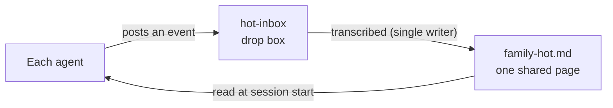

# Family Memory Architecture

<div align="center">

**🇺🇸 English** ｜ [🇯🇵 日本語](README.ja.md) ｜ [🇨🇳 简体中文](README.zh.md) ｜ [🇹🇭 ไทย](README.th.md)


[](https://github.com/caty-ai/family-memory-architecture/actions/workflows/full-suite.yml)
[](LICENSE)


A design, a set of operating rules, and working tools for giving multiple AI agents a shared memory.<br>
AI agents running in different places never know what was decided elsewhere.<br>
We fix that with structure: one short shared page that everyone reads, with decisions and current status funneled into it through a single path.

**Share only the current state. Never blend personalities.**

🔧 [Design document](docs/DESIGN.md) ｜ 📘 [Getting started](docs/getting-started.md)

</div>
<!-- repo-state:begin (generated; do not edit) -->
<p align="center"><sub>generation: <code>e6fea14</code> (2026-08-29T18:27:30Z) · verify: <a href="https://api.github.com/repos/caty-ai/family-memory-architecture/commits/main">API HEAD</a> · <a href="./status.json">status.json</a></sub></p>
<!-- repo-state:end -->

---

<div align="center">


</div>

---

## Table of contents

- [Sound familiar?](#problems)
- [What you get](#what-you-get)
- [What you need](#requirements)
- [Get started](#get-started)
- [Why it is safe to use](#safety)
- [When it is not for you](#not-for-you)
- [Project status](#status)
- [Learn more](#docs)
- [Part of Family OS](#family-os)
- [Acknowledgments](#acknowledgments)
- [License](#license)

---

<a id="problems"></a>

## Sound familiar?

Run two or more AI agents on different machines or different services, and the following starts happening.

- **Decisions don't travel** — one AI decides something, the other never hears about it
- **You re-explain everything** — every new session starts from zero with the same background
- **No one knows what's current** — information on the same topic is scattered across places
- **Nothing is traceable** — nobody can tell where "that's what I was told" came from

This repository exists to crush those four problems with structure, not willpower.

---

<a id="what-you-get"></a>

## What you get

It does exactly one thing: create one short shared page that everyone reads, and narrow the write path into it down to a single route. Each agent's personality, system prompt, and local memory are left untouched.



- 📋 **Everything on one page**

  Only what the whole team needs to know right now — who decided what, how far things have progressed — collected into a single Markdown file in a shared folder. Long meeting notes and design docs stay where they are; the shared page carries only links to them.

- 📮 **Writes go through a drop box**

  Agents cannot edit the shared page directly. They post events one file at a time, and only the transcriber program rewrites the shared page. So the format never breaks, and provenance is always recorded.

- 🔍 **Search everything with one command**

  The shared page, the local search index, and cloud long-term memory can all be queried at once through a single command, `recall`. It works with the cloud layer left out.

What you need to run it is less than you might think.

---

<a id="requirements"></a>

## What you need

The minimal setup needs only Python 3 and an empty folder. Everything else is an optional layer you can add later.

| Aspect | Support |
|---|---|
| Runtime | ✅ Python 3.14 (verified with 3.14.3) ／ ⚠️ 3.13 and below unverified (3.9 measured with one test failure) |
| OS | ✅ macOS (test suite verified) ／ ✅ Linux (server-side scripts in daily production use) ／ ✅ Windows via WSL2 (keep the vault on ext4, not `/mnt/c` — see [getting-started](docs/getting-started.md)) |
| Dependencies | ✅ None (Python standard library only) |
| Agent environments verified in real use | ✅ Claude Code ／ ✅ Hermes Agent ／ ✅ OpenClaw |
| Environments planned for verification | ⚠️ Kimi Code ／ ⚠️ Codex |

> **Note:** "Verified in real use" means an agent in that environment reads the shared page, posts to the drop box, or runs the transcriber every day in our own production family. ⚠️ means "not run there yet" — not "known not to work."

The list is this broad because the bar for joining is low. Any agent that can read files and run shell commands can participate — no dedicated integration needed.

There are three optional layers you can add later. None of them are ours; each can be swapped for any tool that plays the same role.

- **Shared-folder sync**

  The layer that lets a second machine read the same shared page. A device-to-device sync tool such as [Syncthing](https://syncthing.net/) mirrors the shared folder as-is.

- **Local full-text search**

  The layer that pulls up past records instantly by name or error message. An ingest script targeting [Meilisearch](https://www.meilisearch.com/) is included.

- **Cloud long-term memory**

  The layer that mixes in fuzzy, long-horizon context. [Supermemory](https://supermemory.ai/) is supported. To start free without a paid plan, choose the [self-hosted OSS version](https://github.com/supermemoryai/supermemory) or run local-only without this layer (`recall --local-only`).

If your machines span multiple locations, lay down a direct device-to-device network such as [Tailscale](https://tailscale.com/) first — it keeps you from opening ports to the outside. And while the shared folder is just a folder, opening it in [Obsidian](https://obsidian.md/) makes reading and writing pleasant on the human side.

For the big picture of which tool goes where, see the Family OS [recommended stack](https://github.com/caty-ai/family-os/blob/main/docs/recommended-stack.md); for the full table of assumptions in this environment, see the [supported platforms section of the getting-started guide](docs/getting-started.md#対応プラットフォーム).

---

<a id="get-started"></a>

## Get started

Start on a single computer and confirm you can produce one shared page. It takes a few minutes, and cleanup is deleting a single folder.

### Have your AI install it

Paste the following, as-is, to the agent you use.

```text
Clone https://github.com/caty-ai/family-memory-architecture and run the four
commands under "Run it yourself" in the README, in order.
Create the vault inside the cloned folder under the name demo-vault.
Finally, show me the contents of the generated demo-vault/00_index/family-hot.md.
```

That was the single-machine demo. To hand over a full installation — daily use plus choosing the optional layers (sync, search, cloud memory) — paste this instead. The guide it points to instructs your agent to explain each layer's role and cost, and to confirm your choice before installing anything.

```text
Clone https://github.com/caty-ai/family-memory-architecture, read INSTALL.md
and then docs/agent-guide.md, and follow that guide to set things up.
For each optional layer, explain its role and cost to me and confirm my
choice before installing it.
```

### Run it yourself

Run this under your home directory. The default permission self-check now accepts directories whose group ownership differs from usual (such as `/tmp`) as long as the generated files remain owned by the current user and forced to `0600`; only a pinned `FMA_EXPECT_OWNER` deployment still treats an owner/group mismatch as a hard failure.

```bash
git clone https://github.com/caty-ai/family-memory-architecture
cd family-memory-architecture
mkdir -p demo-vault/00_index/hot-inbox

# 1. Post one decision, standing in for an agent
./scripts/hot-inbox-post --kind decision \
  --title "First share" \
  --summary "Confirm that one shared page can be produced." \
  --canonical-path "family-vault/30_decisions/first.md" \
  --owner me --agent me --priority P2 \
  --inbox-dir ./demo-vault/00_index/hot-inbox

# 2. Transcribe the drop box into the shared page (keeps the run record inside demo-vault too)
FMA_HEARTBEAT_DIR=./demo-vault/.heartbeats ./scripts/family-hot-generate --vault-root ./demo-vault

# 3. Check the shared page against the contract
./scripts/family-hot-lint --vault-root ./demo-vault

# 4. Verify it is intact, then read it
./scripts/family-hot-read --path ./demo-vault/00_index/family-hot.md --check
```

When all four finish, you get a page like this.

```text
<!-- GENERATED-FILE: family-hot.md; DO NOT EDIT BY HAND -->
<!-- generator: family-hot-generator v0; sources_sha256: 32010f853d28e415942749a56064408e4458ae0647c53763e0c00c6d6720c1d5; body_sha256: 57d35b82582c9ab51c7781dbb34b5d9a507c59da7063b336a333ceab664403e4 -->
# Family Hot

## C5 Recent decisions
- [class:5 id:20260804T113606Z__me__decision__event__00e60bb0] First share | Confirm that one shared page can be produced. | ptr: family-vault/30_decisions/first.md; o: me; p: P2; at: 2026-08-04T11:36:06.876690Z

---
- [class:1 id:generator-heartbeat] at: 2026-08-04T11:36:06.919353Z; gen: family-hot-generator v0; pinned: #4
```

The above is real output pasted verbatim. The hashes and timestamps change on every run.

Have each agent read this one page at session start, and the minimal setup is complete. To stop trying it out, delete the `demo-vault` folder — nothing else is written anywhere.

To share across a second machine and beyond, sync the shared folder between participating machines and run the transcriber periodically on an always-on machine. See Steps 1–6 of the [getting-started guide](docs/getting-started.md).

You have seen that it works. Next: why it won't fall apart.

---

<a id="safety"></a>

## Why it is safe to use

What makes shared systems scary is being overwritten behind your back, and being fed something broken. Both are sealed off by design.

- **Personalities are never touched** — only a short snapshot of current state is shared; system prompts and local memory stay as they are
- **There is exactly one writer** — only the transcriber program rewrites the shared page; hand edits are caught by the check
- **Verify before reading** — marker, checksum, and size are checked before the content is ever read
- **Failure keeps the last good page** — if transcription fails, the previous valid shared page is left in place
- **An outage never stops work** — if a memory layer goes down, you lose one search layer and keep working

The posting script includes a check that rejects secret-looking strings (it stops known patterns; it is not a cure-all). The generated shared page's file permissions are owner read/write only (0600). How far you sync the shared folder, though, remains an operational decision.

One more boundary matters. FMA shares information only — **it holds no authority to drive other agents**. Executing work, and judging whether work is "done," stay with each individual agent.

For the design philosophy and the full list of failure modes, see the [design document](docs/DESIGN.md).

That was the case for when it fits. Here is when it doesn't, stated up front.

---

<a id="not-for-you"></a>

## When it is not for you

If any of the following applies, adopting this now won't repay the effort.

- **You run a single agent** — the shared page pays off from the second agent (though cross-layer search helps even with one)
- **Everything lives in one tool on one machine** — that tool's own memory feature is enough
- **You want an install-and-done product** — this is a reference architecture with working code; paths and names are meant to be adapted to your environment

If you've judged it a fit, here is an honest account of what's done and what's in progress.

---

<a id="status"></a>

## Project status

[](https://github.com/caty-ai/family-memory-architecture/actions/workflows/full-suite.yml)

- **CI**: The full test suite runs on every push and pull request on Python 3.9 and 3.14, with an exact-count gate. Run it locally with `make test` (runs the full suite plus the publication gate; use `python3 scripts/tests/run_tests.py` to run the suite directly).
- **Verified environments**: `ubuntu-latest` is the CI matrix OS (Python 3.9 / 3.14); macOS is used as a development host outside the CI matrix. In containers without a reaping init, one test self-skips by design ([issue #31](https://github.com/caty-ai/family-memory-architecture/issues/31)).
- **Maturity**: `reference` — Published under the MIT License. Single-host to few-host deployments work today; multi-host distribution is still in progress ([Pre-distribution checklist](docs/pre-distribution-rc.md), DRAFT).
- **Known limitations**: Multi-host distribution, restore rehearsal, and sustained-operation observation are not yet evidence-backed (see the table below).

| State | What | Evidence |
|---|---|---|
| Implemented | Shared page (post, transcribe, lint, read) | `scripts/tests/test_family_hot_generate.py` |
| Implemented | Cross-layer search `recall` | `scripts/tests/test_recall.py` |
| Implemented | Ingest restricted to allow-listed indexes | `scripts/tests/test_meili_ingest.py` |
| Implemented | Failure watch (distinguishing stalls, failures, stops) | `scripts/tests/test_jobs_framework.py` |
| In progress | Multi-host distribution, restore rehearsal, sustained-operation observation | [Pre-distribution checklist](docs/pre-distribution-rc.md) (DRAFT) |

> **Note:** "In progress" means the finishing work is still underway — not that the implemented features above are unusable. A setup of one to a few machines works today. Full multi-host distribution, restore rehearsal, and sustained operation with real keys move to "implemented" once their evidence is in; the checklist tracking that is linked above.

That is every fact you need for a decision. The depth lives below.

---

<a id="docs"></a>

## Learn more

| What you want to do | Where to look |
|---|---|
| Design philosophy, failure modes and countermeasures | [docs/DESIGN.md](docs/DESIGN.md) |
| Full setup (Steps 1–6) and day-2 operations | [docs/getting-started.md](docs/getting-started.md) |
| The generate / lint / read contract for the shared page | [docs/family-hot-usage.md](docs/family-hot-usage.md) |
| How to post to the drop box | [docs/hot-inbox-usage.md](docs/hot-inbox-usage.md) |
| Using cross-layer search `recall` | [docs/recall-usage.md](docs/recall-usage.md) |
| Rules for ingesting into the search index | [docs/meili-ingest-usage.md](docs/meili-ingest-usage.md) |
| What the failure watch means | [docs/jobs-framework.md](docs/jobs-framework.md) |
| Where everything lives — directories and all 26 scripts | [docs/repository-map.md](docs/repository-map.md) |
| Contribute | [CONTRIBUTING.md](CONTRIBUTING.md) |
| Report a bug or vulnerability | [SECURITY.md](SECURITY.md) |
| Allocation rules for cloud memory | [policies/supermemory-allocation.md](policies/supermemory-allocation.md) |
| Model-catalog policy (tiers, selection, usage-time stamp, CI gate) | [policies/model-catalog.md](policies/model-catalog.md) |

Where this repository stands in the bigger picture comes next.

---

<a id="family-os"></a>

## Part of Family OS

This repository is a member of **[Family OS](https://github.com/caty-ai/family-os)** — the overall map for running multiple AI agents as one family. It works on its own, and it becomes stronger combined with the others.

<!-- family:generated:family-footer:start -->

---

Part of the **Caty AI family** — open tools for running a family of AI agents. The full map, including modules still being prepared for release, lives in [Family OS](https://github.com/caty-ai/family-os).

| Axis | Module | What it does | State |
| --- | --- | --- | --- |
| Map | [Family OS](https://github.com/caty-ai/family-os) | The map of the whole family — every module, its state, and how they fit | published, MIT |
| Rules | [Family Dev Handbook](https://github.com/caty-ai/family-dev-handbook) | The rules of the road — issues, PRs, worktrees, handoffs, parallel development | published, MIT |
| Vertical · foundation | [Caty Agent Harness](https://github.com/caty-ai/caty-agent-harness) | Task backbone for AI agents — retries, checkpoints, and honest completion | published, MIT |
| Vertical | [context-kit](https://github.com/caty-ai/context-kit) | Six-piece context hygiene kit for one agent — bounded output, delegation briefs, safety guards, recall, worktree snapshots | published, MIT |
| Vertical | [Persona Engine](https://github.com/caty-ai/persona-engine) | Layers relationship and emotion onto an agent's existing persona | published, MIT |
| Vertical | [Persona Growth Loop](https://github.com/caty-ai/persona-growth-loop) | Grows the persona itself — minimal, idempotent proposals | published, MIT |
| Vertical | [X Collector](https://github.com/caty-ai/x-collector) | Turns X and the web into one daily digest — for people and agents | published, MIT |
| Vertical | [Self Growth Loop](https://github.com/caty-ai/self-growth-loop) | Lets an agent grow its own abilities — proposals, governance, adoption records | published, MIT |
| Horizontal · foundation | **Family Memory Architecture** | The memory bus — how the family shares what it knows | published, MIT |
| Horizontal | [Sitter](https://github.com/caty-ai/sitter) | Babysits delegated agent runs — watches, keeps evidence, restarts only within declared bounds | published, MIT |
| Horizontal | [Alpha Nightshift](https://github.com/caty-ai/alpha-nightshift) | Nightly autonomous maintenance loop — isolated night lanes behind a deny-by-default guard; humans cherry-pick in the morning | published, MIT |

<!-- family:generated:family-footer:end -->

The rules for developing in parallel as a family live in the [Family Dev Handbook](https://github.com/caty-ai/family-dev-handbook). And connecting never moves authority: FMA shares information; it does not drive other agents.

Finally, our thanks to the foundations this system stands on.

---

<a id="acknowledgments"></a>

## Acknowledgments

FMA is built on top of the following tools and services, none of which we made.

- [Syncthing](https://syncthing.net/) — the sync layer that mirrors the shared folder across devices
- [Meilisearch](https://www.meilisearch.com/) — the full-text search engine that pulls up past records instantly
- [Obsidian](https://obsidian.md/) — the note base for humans to read and write the shared folder
- [Supermemory](https://supermemory.ai/) — cloud long-term memory across sessions ([OSS version](https://github.com/supermemoryai/supermemory) available)
- [Tailscale](https://tailscale.com/) — the network that connects machines directly and safely

The grep layer of `recall` gets faster with [ripgrep](https://github.com/BurntSushi/ripgrep). Our thanks to all of their developers.

---

<a id="license"></a>

## License

Licensed under [MIT](LICENSE). We chose MIT because we want anyone to use this freely and remake it for their own family. The repository is published under [caty-ai](https://github.com/caty-ai).

---

<div align="center">

**One Markdown page** ｜ **Starts without pip** ｜ **Any agent**

</div>

