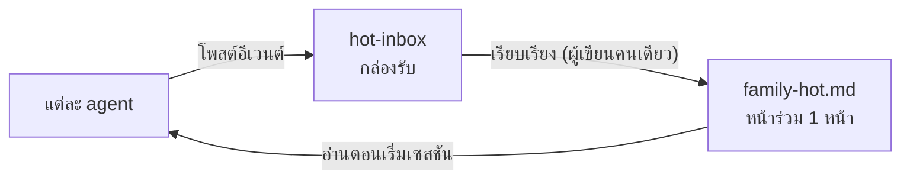

# Family Memory Architecture

<div align="center">

[🇺🇸 English](README.md) ｜ [🇯🇵 日本語](README.ja.md) ｜ [🇨🇳 简体中文](README.zh.md) ｜ **🇹🇭 ไทย**


[](LICENSE)


นี่คือชุดของแนวคิดออกแบบ กติกาการทำงาน และเครื่องมือใช้งานจริง เพื่อให้ AI agent หลายตัวมี "ความทรงจำร่วม" กันได้<br>
AI agent ที่ทำงานอยู่คนละที่ จะไม่มีทางรู้เลยว่าอีกฝั่งตัดสินใจอะไรไปแล้ว<br>
เราแก้ปัญหานี้ด้วยโครงสร้าง: สร้างหน้าเดียวสั้นๆ ที่ทุกคนอ่าน แล้วรวมเส้นทางการเขียนข้อมูล การตัดสินใจ และสถานะปัจจุบันให้ไหลผ่านช่องทางเดียวเข้าสู่หน้านั้น

**แชร์แค่สถานะล่าสุด ไม่ปนตัวตนกัน**

🔧 [เอกสารออกแบบ](docs/DESIGN.md) ｜ 📘 [เริ่มต้นใช้งาน](docs/getting-started.md)

</div>

---

## สารบัญ

- [คุ้นๆ ไหม?](#problems)
- [สิ่งที่คุณจะได้](#what-you-get)
- [สิ่งที่ต้องมี](#requirements)
- [เริ่มต้นใช้งาน](#get-started)
- [ทำไมถึงใช้ได้อย่างปลอดภัย](#safety)
- [เมื่อไหร่ที่ไม่เหมาะกับคุณ](#not-for-you)
- [สิ่งที่ทำได้แล้ว และสิ่งที่ยังไม่ได้](#status)
- [เรียนรู้เพิ่มเติม](#docs)
- [เป็นส่วนหนึ่งของ Family OS](#family-os)
- [ขอบคุณ](#acknowledgments)
- [สัญญาอนุญาต](#license)

---

<a id="problems"></a>

## คุ้นๆ ไหม?

เมื่อคุณรัน AI agent ตั้งแต่ 2 ตัวขึ้นไป บนเครื่องคนละเครื่องหรือคนละบริการ สิ่งเหล่านี้จะเริ่มเกิดขึ้น

- **การตัดสินใจไม่เดินทาง** — AI ตัวหนึ่งตัดสินใจอะไรไป อีกตัวไม่มีทางรู้เลย
- **ต้องอธิบายซ้ำทุกครั้ง** — ทุกเซสชันใหม่เริ่มจากศูนย์ด้วยข้อมูลพื้นหลังเดิมๆ
- **ไม่มีใครรู้ว่าอะไรคือข้อมูลล่าสุด** — ข้อมูลเรื่องเดียวกันกระจัดกระจายอยู่หลายที่
- **ตามที่มาไม่ได้เลย** — ไม่มีใครบอกได้ว่า "ที่บอกมาแบบนั้น" มันมาจากไหน

รีโปนี้เกิดขึ้นเพื่อกำจัดปัญหาทั้ง 4 ข้อนี้ด้วยโครงสร้าง ไม่ใช่ด้วยความพยายามล้วนๆ

---

<a id="what-you-get"></a>

## สิ่งที่คุณจะได้

มันทำสิ่งเดียวเท่านั้น: สร้างหน้าเดียวสั้นๆ ที่ทุกคนอ่านร่วมกัน แล้วรวบเส้นทางการเขียนให้เหลือเส้นทางเดียว ส่วนบุคลิก (personality), system prompt และความทรงจำในเครื่องของแต่ละ agent จะไม่ถูกแตะต้องเลย



- 📋 **รวมทุกอย่างไว้ในหน้าเดียว**

  เฉพาะสิ่งที่ทั้งทีมต้องรู้ตอนนี้ — ใครตัดสินใจอะไร ไปถึงไหนแล้ว — ถูกรวบรวมไว้ในไฟล์ Markdown เดียวในโฟลเดอร์ที่แชร์กัน บันทึกการประชุมยาวๆ หรือเอกสารออกแบบยังอยู่ที่เดิม หน้าร่วมจะมีแค่ลิงก์ไปหาสิ่งเหล่านั้น

- 📮 **การเขียนต้องผ่านกล่องรับ**

  Agent แก้ไขหน้าร่วมโดยตรงไม่ได้ พวกมันโพสต์อีเวนต์ทีละไฟล์ และมีเพียงโปรแกรมเรียบเรียง (transcriber) เท่านั้นที่เขียนหน้าร่วมใหม่ ดังนั้นรูปแบบจะไม่มีวันพัง และที่มาของข้อมูลจะถูกบันทึกไว้เสมอ

- 🔍 **ค้นหาทุกอย่างด้วยคำสั่งเดียว**

  หน้าร่วม ดัชนีค้นหาในเครื่อง และความทรงจำระยะยาวบนคลาวด์ สามารถค้นพร้อมกันได้ทั้งหมดผ่านคำสั่งเดียวคือ `recall` และมันยังใช้งานได้แม้ไม่มีชั้นคลาวด์เลยก็ตาม

สิ่งที่ต้องมีเพื่อรันระบบนี้น้อยกว่าที่คุณคิดไว้

---

<a id="requirements"></a>

## สิ่งที่ต้องมี

การตั้งค่าขั้นต่ำต้องการแค่ Python 3 กับโฟลเดอร์เปล่าๆ เท่านั้น ส่วนที่เหลือทั้งหมดเป็นชั้นเสริมที่เพิ่มทีหลังได้

| แง่มุม | สถานะรองรับ |
|---|---|
| Runtime | ✅ Python 3.14 (ทดสอบจริงกับ 3.14.3) ／ ⚠️ 3.13 ลงไปยังไม่ได้ตรวจสอบ (3.9 พบเทสต์ไม่ผ่าน 1 รายการ) |
| OS | ✅ macOS (ผ่านชุดทดสอบเต็ม) ／ ✅ Linux (สคริปต์ฝั่งเซิร์ฟเวอร์ทำงานจริงทุกวัน) |
| Dependencies | ✅ ไม่มี (ใช้เฉพาะ Python standard library) |
| สภาพแวดล้อม AI agent ที่ยืนยันจากการใช้งานจริง | ✅ Claude Code ／ ✅ Hermes Agent ／ ✅ OpenClaw |
| สภาพแวดล้อมที่วางแผนจะตรวจสอบ | ⚠️ Kimi Code ／ ⚠️ Codex |

> **หมายเหตุ:** "ยืนยันจากการใช้งานจริง" หมายความว่า agent ในสภาพแวดล้อมนั้นทำอย่างน้อยหนึ่งอย่างต่อไปนี้ทุกวันในครอบครัวจริงของเรา: อ่านหน้าร่วม โพสต์ลงกล่องรับเรื่อง หรือรันโปรแกรมเรียบเรียง ส่วน ⚠️ หมายถึง "ยังไม่ได้รันที่นั่น" ไม่ใช่ "รู้ว่ารันไม่ได้"

รายการกว้างได้ขนาดนี้เพราะเงื่อนไขในการเข้าร่วมต่ำมาก agent ตัวไหนก็ตามที่อ่านไฟล์และรันคำสั่ง shell ได้ ก็เข้าร่วมได้เลย ไม่ต้องมีการเชื่อมต่อเฉพาะ

มีชั้นเสริมที่เพิ่มทีหลังได้อีก 3 ชั้น ไม่มีชั้นไหนที่เราสร้างเอง แต่ละชั้นสลับไปใช้เครื่องมืออื่นที่ทำหน้าที่เดียวกันได้

- **การซิงก์โฟลเดอร์ที่แชร์กัน**

  ชั้นที่ทำให้เครื่องที่สองอ่านหน้าร่วมเดียวกันได้ เครื่องมือซิงก์แบบเครื่องต่อเครื่อง เช่น [Syncthing](https://syncthing.net/) จะทำให้โฟลเดอร์ที่แชร์กันเหมือนกันทุกเครื่อง

- **การค้นหาข้อความเต็มในเครื่อง**

  ชั้นที่ดึงบันทึกในอดีตขึ้นมาได้ทันทีด้วยชื่อหรือข้อความ error สคริปต์นำเข้าข้อมูลสำหรับ [Meilisearch](https://www.meilisearch.com/) รวมอยู่ในรีโปนี้แล้ว

- **ความทรงจำระยะยาวบนคลาวด์**

  ชั้นที่ผสมบริบทที่คลุมเครือและกินเวลานานเข้าไปด้วย รองรับ [Supermemory](https://supermemory.ai/) ถ้าอยากเริ่มใช้ฟรีโดยไม่ต้องเสียเงินเป็นแพ็กเกจ ให้เลือก[เวอร์ชันโฮสต์เอง (OSS)](https://github.com/supermemoryai/supermemory) หรือรันแบบใช้เฉพาะในเครื่องโดยไม่ใช้ชั้นนี้เลย (`recall --local-only`)

ถ้าเครื่องของคุณกระจายอยู่หลายที่ ให้วางเครือข่ายแบบเครื่องต่อเครื่องโดยตรงอย่าง [Tailscale](https://tailscale.com/) ก่อน จะได้ไม่ต้องเปิดพอร์ตออกสู่ภายนอก และแม้โฟลเดอร์ที่แชร์กันจะเป็นแค่โฟลเดอร์ธรรมดา แต่ถ้าเปิดด้วย [Obsidian](https://obsidian.md/) ฝั่งมนุษย์จะอ่านและเขียนได้สบายขึ้นมาก

ภาพรวมว่าเครื่องมือไหนควรอยู่ตรงไหน ดูได้ที่[สแต็กที่แนะนำ](https://github.com/caty-ai/family-os/blob/main/docs/recommended-stack.md)ของ Family OS ส่วนตารางสมมติฐานทั้งหมดของสภาพแวดล้อมนี้ ดูได้ที่[ส่วนแพลตฟอร์มที่รองรับในคู่มือเริ่มต้นใช้งาน](docs/getting-started.md#対応プラットフォーム)

---

<a id="get-started"></a>

## เริ่มต้นใช้งาน

เริ่มด้วยคอมพิวเตอร์เครื่องเดียวก่อน แล้วยืนยันว่าคุณสร้างหน้าร่วมได้ 1 หน้า ใช้เวลาแค่ไม่กี่นาที และล้างข้อมูลก็แค่ลบโฟลเดอร์เดียว

### ให้ AI ของคุณติดตั้งให้

คัดลอกข้อความด้านล่างนี้ วางให้ agent ที่คุณใช้อยู่ตามนี้เลย โดยไม่ต้องแก้ไข

```text
Clone https://github.com/caty-ai/family-memory-architecture และรันคำสั่งทั้ง 4
ที่อยู่ใต้หัวข้อ "Run it yourself" ใน README ตามลำดับ
สร้าง vault ไว้ในโฟลเดอร์ที่ clone มา ตั้งชื่อว่า demo-vault
สุดท้าย ให้แสดงเนื้อหาของ demo-vault/00_index/family-hot.md ที่ถูกสร้างขึ้นมาให้ดูด้วย
```

ที่ผ่านมาคือการทดลองบนเครื่องเดียว ถ้าอยากมอบหมายการติดตั้งเต็มรูปแบบ — การใช้งานประจำวัน รวมถึงการเลือกชั้นเสริม (ซิงก์, ค้นหา, หน่วยความจำคลาวด์) — ให้วางข้อความนี้แทน ไกด์ที่ลิงก์ไว้กำหนดให้ agent ของคุณอธิบายบทบาทและค่าใช้จ่ายของแต่ละชั้น และยืนยันตัวเลือกของคุณก่อนติดตั้งเสมอ

```text
Clone https://github.com/caty-ai/family-memory-architecture อ่าน INSTALL.md
แล้วตามด้วย docs/agent-guide.md และทำตามไกด์นั้นเพื่อติดตั้ง
สำหรับชั้นเสริมแต่ละชั้น ให้อธิบายบทบาทและค่าใช้จ่ายให้ฉันฟัง
และยืนยันตัวเลือกของฉันก่อนติดตั้งทุกครั้ง
```

### รันเองด้วยตัวเอง

แนะนำให้รันภายใต้โฮมไดเรกทอรีของคุณ การตรวจสิทธิ์เริ่มต้นตอนนี้ยอมรับตำแหน่งที่ group ownership ต่างจากปกติ (เช่น `/tmp`) ได้ ตราบใดที่ไฟล์ที่สร้างยังเป็นของผู้ใช้ปัจจุบันและถูกบังคับเป็น `0600`; มีเพียง deployment ที่ปัก owner:group ไว้ด้วย `FMA_EXPECT_OWNER` เท่านั้นที่ยังถือว่า owner/group ไม่ตรงกันเป็นความผิดพลาดแบบหยุดทันที

```bash
git clone https://github.com/caty-ai/family-memory-architecture
cd family-memory-architecture
mkdir -p demo-vault/00_index/hot-inbox

# 1. โพสต์การตัดสินใจ 1 รายการ แทนตัว agent
./scripts/hot-inbox-post --kind decision \
  --title "First share" \
  --summary "Confirm that one shared page can be produced." \
  --canonical-path "family-vault/30_decisions/first.md" \
  --owner me --agent me --priority P2 \
  --inbox-dir ./demo-vault/00_index/hot-inbox

# 2. เรียบเรียงกล่องรับให้กลายเป็นหน้าร่วม
FMA_HEARTBEAT_DIR=./demo-vault/.heartbeats ./scripts/family-hot-generate --vault-root ./demo-vault

# 3. ตรวจสอบหน้าร่วมตามข้อกำหนด
./scripts/family-hot-lint --vault-root ./demo-vault

# 4. ยืนยันว่าไฟล์ยังสมบูรณ์ แล้วค่อยอ่าน
./scripts/family-hot-read --path ./demo-vault/00_index/family-hot.md --check
```

พอทั้ง 4 ขั้นตอนเสร็จ คุณจะได้หน้าแบบนี้

```text
<!-- GENERATED-FILE: family-hot.md; DO NOT EDIT BY HAND -->
<!-- generator: family-hot-generator v0; sources_sha256: 32010f853d28e415942749a56064408e4458ae0647c53763e0c00c6d6720c1d5; body_sha256: 57d35b82582c9ab51c7781dbb34b5d9a507c59da7063b336a333ceab664403e4 -->
# Family Hot

## C5 Recent decisions
- [class:5 id:20260804T113606Z__me__decision__event__00e60bb0] First share | Confirm that one shared page can be produced. | ptr: family-vault/30_decisions/first.md; o: me; p: P2; at: 2026-08-04T11:36:06.876690Z

---
- [class:1 id:generator-heartbeat] at: 2026-08-04T11:36:06.919353Z; gen: family-hot-generator v0; pinned: #4
```

ข้างบนนี้เป็นผลลัพธ์จริงที่คัดลอกมาแบบคำต่อคำ ค่าแฮชและเวลาจะเปลี่ยนไปทุกครั้งที่รัน

ให้แต่ละ agent อ่านหน้านี้หน้าเดียวตอนเริ่มเซสชัน แล้วการตั้งค่าขั้นต่ำก็เสร็จสมบูรณ์ ถ้าจะหยุดทดลองใช้ ก็แค่ลบโฟลเดอร์ `demo-vault` ทิ้ง ไม่มีอะไรถูกเขียนไว้ที่อื่นเลย

หากต้องการแชร์ข้ามไปยังเครื่องที่สองและมากกว่านั้น ให้ซิงก์โฟลเดอร์ที่แชร์กันระหว่างเครื่องที่เข้าร่วม แล้วรันโปรแกรมเรียบเรียงเป็นระยะบนเครื่องที่เปิดทำงานตลอดเวลา ดูรายละเอียดได้ที่ Step 1–6 ของ[คู่มือเริ่มต้นใช้งาน](docs/getting-started.md)

คุณเห็นแล้วว่ามันทำงานได้จริง ต่อไปคือเหตุผลว่าทำไมมันถึงไม่พังลงมา

---

<a id="safety"></a>

## ทำไมถึงใช้ได้อย่างปลอดภัย

สิ่งที่น่ากลัวของระบบที่แชร์กันคือการถูกเขียนทับโดยไม่รู้ตัว และการถูกป้อนข้อมูลที่พังแล้วให้ ทั้งสองอย่างนี้ถูกปิดกั้นไว้ด้วยการออกแบบ

- **ไม่แตะต้องบุคลิกเลย** — สิ่งที่แชร์กันคือภาพรวมสั้นๆ ของสถานะปัจจุบันเท่านั้น system prompt และความทรงจำในเครื่องยังคงเดิม
- **มีผู้เขียนแค่คนเดียว** — มีเพียงโปรแกรมเรียบเรียงเท่านั้นที่เขียนหน้าร่วมใหม่ การแก้ไขด้วยมือจะถูกตรวจจับได้
- **ตรวจก่อนอ่านเสมอ** — ตรวจสอบเครื่องหมาย, checksum และขนาดไฟล์ก่อนที่จะอ่านเนื้อหาจริง
- **ล้มเหลวแล้วยังเก็บหน้าเดิมไว้** — ถ้าการเรียบเรียงล้มเหลว หน้าร่วมที่ถูกต้องล่าสุดจะยังคงอยู่เหมือนเดิม
- **ระบบล่มไม่ทำให้งานหยุด** — ถ้าชั้นความทรงจำหนึ่งล่ม คุณจะเสียแค่ชั้นค้นหาชั้นเดียว งานยังทำต่อได้

สคริปต์สำหรับโพสต์มีการตรวจสอบที่ปฏิเสธข้อความที่ดูเหมือนข้อมูลลับ (มันหยุดรูปแบบที่รู้จักอยู่แล้ว ไม่ใช่ยาครอบจักรวาล) สิทธิ์ของไฟล์หน้าร่วมที่สร้างขึ้นถูกตั้งเป็นเฉพาะเจ้าของอ่าน/เขียนได้เท่านั้น (0600) แต่จะซิงก์โฟลเดอร์ที่แชร์กันไปไกลแค่ไหน ยังคงเป็นการตัดสินใจในเชิงปฏิบัติการที่คุณต้องเลือกเอง

มีอีกหนึ่งขอบเขตสำคัญ FMA แชร์แค่ข้อมูลเท่านั้น **ไม่มีอำนาจสั่งการ agent ตัวอื่น** การลงมือทำงานจริง และการตัดสินว่างาน "เสร็จแล้วหรือยัง" ยังคงเป็นหน้าที่ของแต่ละ agent เอง

สำหรับปรัชญาการออกแบบและรายการโหมดความล้มเหลวทั้งหมด ดูได้ที่[เอกสารออกแบบ](docs/DESIGN.md)

ข้างต้นคือกรณีที่เหมาะกับคุณ ต่อไปนี้คือกรณีที่ไม่เหมาะ ซึ่งเราขอบอกไว้ล่วงหน้า

---

<a id="not-for-you"></a>

## เมื่อไหร่ที่ไม่เหมาะกับคุณ

ถ้าเข้าเงื่อนไขข้อใดข้อหนึ่งด้านล่างนี้ การนำไปใช้ตอนนี้จะไม่คุ้มกับความพยายาม

- **คุณรัน agent ตัวเดียว** — หน้าร่วมจะคุ้มค่าตั้งแต่ agent ตัวที่สองเป็นต้นไป (แม้การค้นหาข้ามชั้นก็ยังมีประโยชน์อยู่บ้างแม้ใช้ตัวเดียว)
- **ทุกอย่างอยู่ในเครื่องมือเดียวบนเครื่องเดียว** — ฟังก์ชันความจำในตัวของเครื่องมือนั้นก็เพียงพอแล้ว
- **คุณต้องการผลิตภัณฑ์แบบติดตั้งแล้วใช้ได้เลย** — นี่คือสถาปัตยกรรมอ้างอิงพร้อมโค้ดที่ใช้งานได้จริง path และชื่อต่างๆ ถูกออกแบบมาให้คุณปรับให้เข้ากับสภาพแวดล้อมของตัวเอง

ถ้าคุณตัดสินใจแล้วว่ามันเหมาะกับคุณ ต่อไปนี้คือรายงานตามตรงว่าอะไรเสร็จแล้วและอะไรยังอยู่ระหว่างทำ

---

<a id="status"></a>

## สิ่งที่ทำได้แล้ว และสิ่งที่ยังไม่ได้

| สถานะ | อะไร | หลักฐาน |
|---|---|---|
| ทำเสร็จแล้ว | หน้าร่วม (โพสต์ / เรียบเรียง / ตรวจสอบ / อ่าน) | `scripts/tests/test_family_hot_generate.py` |
| ทำเสร็จแล้ว | การค้นหาข้ามชั้น `recall` | `scripts/tests/test_recall.py` |
| ทำเสร็จแล้ว | การนำเข้าที่จำกัดเฉพาะดัชนีในรายการอนุญาต | `scripts/tests/test_meili_ingest.py` |
| ทำเสร็จแล้ว | การเฝ้าดูความล้มเหลว (แยกแยะระหว่างค้างอยู่ / ล้มเหลว / หยุด) | `scripts/tests/test_jobs_framework.py` |
| กำลังดำเนินการ | การกระจายหลายโฮสต์, การซ้อมกู้คืน, การสังเกตการทำงานต่อเนื่อง | [รายการตรวจสอบก่อนกระจาย](docs/pre-distribution-rc.md) (DRAFT) |

รันชุดทดสอบทั้งหมดได้ด้วย `python3 scripts/tests/run_tests.py` (ไฟล์ `test_write_guard.py` และ `test_injection_lint.py` ไม่ได้รวมอยู่ในตัวรัน ให้รันแยกต่างหาก) ณ วันที่ 2026-08-05 การรันแบบเต็มจบลงด้วยผลลัพธ์ passed=358 / failed=0 / errors=0

> **หมายเหตุ:** "กำลังดำเนินการ" หมายถึงงานเก็บรายละเอียดยังเดินอยู่ ไม่ได้แปลว่าฟีเจอร์ที่ทำเสร็จแล้วด้านบนใช้ไม่ได้ การติดตั้งบนหนึ่งถึงไม่กี่เครื่องทำได้ตั้งแต่วันนี้ ส่วนการกระจายหลายโฮสต์เต็มรูปแบบ การซ้อมกู้คืน และการใช้งานต่อเนื่องด้วยคีย์จริง จะเลื่อนขึ้นเป็น "ทำเสร็จแล้ว" เมื่อหลักฐานครบ โดยติดตามความคืบหน้าได้จากรายการตรวจสอบที่ลิงก์ไว้ด้านบน

นี่คือข้อเท็จจริงทั้งหมดที่คุณต้องรู้เพื่อตัดสินใจ รายละเอียดเชิงลึกอยู่ด้านล่างนี้

---

<a id="docs"></a>

## เรียนรู้เพิ่มเติม

| สิ่งที่คุณอยากทำ | ดูที่ไหน |
|---|---|
| ปรัชญาการออกแบบ, โหมดความล้มเหลวและวิธีรับมือ | [docs/DESIGN.md](docs/DESIGN.md) |
| การตั้งค่าแบบเต็ม (Step 1–6) และการดำเนินงานหลังวันที่สอง | [docs/getting-started.md](docs/getting-started.md) |
| ข้อกำหนดของการสร้าง / ตรวจสอบ / อ่านหน้าร่วม | [docs/family-hot-usage.md](docs/family-hot-usage.md) |
| วิธีโพสต์เข้ากล่องรับ | [docs/hot-inbox-usage.md](docs/hot-inbox-usage.md) |
| การใช้การค้นหาข้ามชั้น `recall` | [docs/recall-usage.md](docs/recall-usage.md) |
| กติกาการนำเข้าสู่ดัชนีค้นหา | [docs/meili-ingest-usage.md](docs/meili-ingest-usage.md) |
| ความหมายของการเฝ้าดูความล้มเหลว | [docs/jobs-framework.md](docs/jobs-framework.md) |
| โครงสร้างทั้งรีโปและหน้าที่ของสคริปต์ทั้ง 25 ตัว | [docs/repository-map.md](docs/repository-map.md) |
| อยากร่วมพัฒนา | [CONTRIBUTING.md](CONTRIBUTING.md) |
| พบบั๊กหรือช่องโหว่ | [SECURITY.md](SECURITY.md) |
| กติกาการจัดสรรความทรงจำบนคลาวด์ | [policies/supermemory-allocation.md](policies/supermemory-allocation.md) |

ต่อไป มาดูกันว่ารีโปนี้ยืนอยู่ตรงไหนของภาพรวมทั้งหมด

---

<a id="family-os"></a>

## เป็นส่วนหนึ่งของ Family OS

รีโปนี้เป็นสมาชิกของ **[Family OS](https://github.com/caty-ai/family-os)** — แผนที่ภาพรวมสำหรับการดูแลเอเจนต์ AI หลายตัวเป็นครอบครัวเดียวกัน มันใช้งานเดี่ยวๆ ได้เลย แต่จะยิ่งมีพลังเมื่อประกอบกับตัวอื่น — ตารางโมดูลฉบับเต็มอยู่ในส่วนท้ายของหน้านี้ (family footer)

กติกาสำหรับการพัฒนาแบบขนานทั้งครอบครัวอยู่ใน [Family Dev Handbook](https://github.com/caty-ai/family-dev-handbook) และการเชื่อมต่อไม่ได้ย้ายอำนาจการทำงาน: FMA แค่แชร์ข้อมูล ไม่ได้สั่งการ agent ตัวอื่น

สุดท้ายนี้ ขอขอบคุณรากฐานที่ระบบนี้ยืนอยู่บน

---

<a id="acknowledgments"></a>

## ขอบคุณ

FMA ถูกสร้างขึ้นบนเครื่องมือและบริการต่อไปนี้ ซึ่งไม่มีชิ้นไหนที่เราเป็นผู้สร้างเอง

- [Syncthing](https://syncthing.net/) — ชั้นซิงก์ที่ทำให้โฟลเดอร์ที่แชร์กันเหมือนกันในทุกเครื่อง
- [Meilisearch](https://www.meilisearch.com/) — เอนจินค้นหาข้อความเต็มที่ดึงบันทึกในอดีตขึ้นมาได้ทันที
- [Obsidian](https://obsidian.md/) — ฐานโน้ตสำหรับให้มนุษย์อ่านและเขียนโฟลเดอร์ที่แชร์กัน
- [Supermemory](https://supermemory.ai/) — ความทรงจำระยะยาวบนคลาวด์ข้ามเซสชัน (มี[เวอร์ชัน OSS](https://github.com/supermemoryai/supermemory) ให้เลือกใช้)
- [Tailscale](https://tailscale.com/) — เครือข่ายที่เชื่อมเครื่องต่างๆ เข้าด้วยกันโดยตรงและปลอดภัย

ชั้น grep ของ `recall` จะทำงานเร็วขึ้นเมื่อมี [ripgrep](https://github.com/BurntSushi/ripgrep) ขอขอบคุณนักพัฒนาของทุกโปรเจกต์เหล่านี้

---

<a id="license"></a>

## สัญญาอนุญาต

อยู่ภายใต้สัญญาอนุญาต [MIT](LICENSE) เราเลือก MIT เพราะอยากให้ทุกคนใช้งานได้อย่างอิสระ และนำไปดัดแปลงใหม่สำหรับครอบครัวของตัวเอง รีโปนี้เผยแพร่แล้วภายใต้ [caty-ai](https://github.com/caty-ai)

---

<div align="center">

**Markdown หน้าเดียว** ｜ **เริ่มได้โดยไม่ต้อง pip** ｜ **agent ตัวไหนก็ได้**

</div>

<!-- family:generated:family-footer:start -->

---

รีโพนี้เป็นส่วนหนึ่งของ **ครอบครัว Caty AI** — ชุดเครื่องมือโอเพนซอร์สสำหรับดูแลครอบครัวเอเจนต์ AI แผนที่ฉบับเต็ม (รวมโมดูลที่กำลังเตรียมเปิด) อยู่ที่ [Family OS](https://github.com/caty-ai/family-os)

| แกน | โมดูล | ทำอะไร | สถานะ |
| --- | --- | --- | --- |
| แผนที่ | [Family OS](https://github.com/caty-ai/family-os) | แผนที่ของทั้งครอบครัว — โมดูล สถานะ และโครงสร้าง | เปิดแล้ว・MIT |
| กติกา | [Family Dev Handbook](https://github.com/caty-ai/family-dev-handbook) | กติกากลางของการพัฒนา — Issue, PR, worktree, การส่งงานต่อ และการทำงานคู่ขนาน | เปิดแล้ว・MIT |
| แกนตั้ง · รากฐาน | [Caty Agent Harness](https://github.com/caty-ai/caty-agent-harness) | แกนงานของเอเจนต์ AI — การลองใหม่ เช็คพอยต์ และการตัดสินว่าเสร็จจริง | เปิดแล้ว・MIT |
| แกนตั้ง | [context-kit](https://github.com/caty-ai/context-kit) | ชุดดูแลคอนเท็กซ์สำหรับเอเจนต์หนึ่งตัว — จำกัดเอาต์พุตขนาดใหญ่, ตรวจ brief การมอบงาน, การ์ดความปลอดภัย, ค้นความทรงจำ | เปิดแล้ว・MIT |
| แกนตั้ง | [Persona Engine](https://github.com/caty-ai/persona-engine) | มอบบุคลิกให้เอเจนต์ — เลเยอร์บุคลิกและอารมณ์แบบไล่ระดับ | เปิดแล้ว・MIT |
| แกนตั้ง | **Persona Growth Loop** | พัฒนาบุคลิกของเอเจนต์ — สร้างข้อเสนอแบบน้อยที่สุดและทำซ้ำได้ | กำลังเตรียมเปิด |
| แกนตั้ง | [X Collector](https://github.com/caty-ai/x-collector) | รวบรวมข้อมูลจาก X และเว็บเป็นสรุปวันละฉบับ — สำหรับคนและเอเจนต์ | เปิดแล้ว・MIT |
| แกนตั้ง | **Self Growth Loop** | วงจรให้เอเจนต์พัฒนาความสามารถของตัวเอง — ข้อเสนอ ธรรมาภิบาล และบันทึกการนำไปใช้ | กำลังเตรียมเปิด |
| แกนนอน · รากฐาน | **Family Memory Architecture** | บัสความทรงจำ — ชั้นที่ครอบครัวใช้แบ่งปันสิ่งที่รู้ | เปิดแล้ว・MIT |
| แกนนอน | [Sitter](https://github.com/caty-ai/sitter) | พี่เลี้ยงของงานที่มอบหมายให้เอเจนต์ — เฝ้าดู เก็บหลักฐาน และรีสตาร์ต | เปิดแล้ว・MIT |

<!-- family:generated:family-footer:end -->
