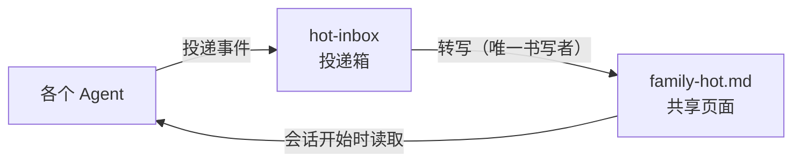

# Family Memory Architecture

<div align="center">

[🇺🇸 English](README.md) ｜ [🇯🇵 日本語](README.ja.md) ｜ **🇨🇳 简体中文** ｜ [🇹🇭 ไทย](README.th.md)


[](https://github.com/caty-ai/family-memory-architecture/actions/workflows/full-suite.yml)
[](LICENSE)


这是一套设计、一组运行规则，以及一批真正可用的工具，用来让多个 AI Agent 拥有共享的记忆。<br>
在不同地方运行的 AI，彼此不知道对方决定了什么。<br>
我们用结构来解决这个问题：只做一张所有人都会读的简短共享页面，把决定和当前状态都收拢到这一条路径上。

**只共享现状，绝不混同人格。**

🔧 [设计文档](docs/DESIGN.md) ｜ 📘 [新手指南](docs/getting-started.md)

</div>

---

## 目录

- [似曾相识吗？](#problems)
- [能做到什么](#what-you-get)
- [需要准备什么](#requirements)
- [开始使用](#get-started)
- [为什么可以放心使用](#safety)
- [不适合你的情况](#not-for-you)
- [项目状态](#status)
- [了解更多](#docs)
- [Family OS 的一员](#family-os)
- [致谢](#acknowledgments)
- [许可证](#license)

---

<a id="problems"></a>

## 似曾相识吗？

只要同时运行两个以上的 AI Agent，分布在不同机器或不同服务上，下面这些事就会开始发生。

- **决定传不过去** — 一个 AI 决定了什么，另一个从来没听说过
- **每次都要重新解释** — 每个新会话都从零开始讲同样的背景
- **不知道哪个是最新的** — 同一个话题的信息散落在各处
- **无法追溯来源** — 没人能说清"我是这么被告知的"到底是从哪来的

这个仓库存在的意义，就是用结构、而不是靠意志力，来消灭这四个问题。

---

<a id="what-you-get"></a>

## 能做到什么

要做的事情只有一件：创建一张所有人都会读的简短共享页面，并把写入这张页面的路径收窄成唯一一条。每个 Agent 的人格、system prompt 和本地记忆都不会被触碰。



- 📋 **一切汇总到一张页面**

  把此刻团队所有人都需要知道的内容——谁决定了什么、进展到哪一步——汇总进共享文件夹里的一份 Markdown 文件。长篇的会议记录和设计文档仍留在原处，共享页面上只放通往它们的链接。

- 📮 **写入要经过投递箱**

  Agent 不能直接编辑共享页面。它们每次投递一个事件、一个文件，只有转写程序会改写共享页面。所以格式不会被破坏，来源也始终留有记录。

- 🔍 **一条命令搜遍所有层**

  共享页面、本地搜索索引、云端长期记忆，都可以通过一条命令 `recall` 一次性查询。去掉云端这一层也能照常使用。

运行它所需要的东西，比你想象的要少。

---

<a id="requirements"></a>

## 需要准备什么

最小配置只需要 Python 3 和一个空文件夹。其余的都是之后可以再添加的可选层。

| 方面 | 支持情况 |
|---|---|
| 运行环境 | ✅ Python 3.14（已用 3.14.3 验证）／ ⚠️ 3.13 及以下未验证（3.9 实测有一个测试不通过） |
| 操作系统 | ✅ macOS（已通过完整测试套件验证）／ ✅ Linux（服务器端脚本每天在生产环境运行） |
| 依赖 | ✅ 无（仅使用 Python 标准库） |
| 已在实际运行中验证的 AI Agent 环境 | ✅ Claude Code ／ ✅ Hermes Agent ／ ✅ OpenClaw |
| 计划进行验证的环境 | ⚠️ Kimi Code ／ ⚠️ Codex |

> **备注:** 「已在实际运行中验证」的意思是，该环境下的 Agent 在我们自己的家族生产运行中，每天执行共享页面的读取、向投递箱投递事件、或运行转写程序中的至少一项。⚠️ 表示「还没有在那个环境跑过」，并不代表已知无法运行。

支持范围能有这么广，是因为加入的门槛很低。只要是能读取文件、执行 shell 命令的 Agent，都可以参与——不需要专门的对接功能。

有三个可以后续添加的可选层。它们都不是我们自己开发的，都可以替换成承担相同角色的任意工具。

- **共享文件夹同步**

  让第二台及以后的机器读取同一张共享页面的层。像 [Syncthing](https://syncthing.net/) 这样的设备间同步工具，可以按原样镜像共享文件夹。

- **本地全文搜索**

  能凭名称或错误信息瞬间调出过去记录的层。项目中内置了面向 [Meilisearch](https://www.meilisearch.com/) 的导入脚本。

- **云端长期记忆**

  用于混入模糊、长跨度上下文的层。已支持 [Supermemory](https://supermemory.ai/)。如果想不用付费方案、免费开始，可以选择[自托管的 OSS 版本](https://github.com/supermemoryai/supermemory)，或者不用这一层、只做本地运行（`recall --local-only`）。

如果你的机器分布在多个地点，建议先搭建像 [Tailscale](https://tailscale.com/) 这样的设备间直连网络——这样就不用对外开放端口。共享文件夹本身只是一个普通文件夹，但用 [Obsidian](https://obsidian.md/) 打开后，人在阅读和书写上会更顺手。

关于该把哪个工具放在哪个位置的整体图景，请见 Family OS 的[推荐技术栈](https://github.com/caty-ai/family-os/blob/main/docs/recommended-stack.md)；关于本环境中所有前提条件的完整表格，请见[导入指南中的支持平台一节](docs/getting-started.md#対応プラットフォーム)。

---

<a id="get-started"></a>

## 开始使用

先在一台电脑上，确认能生成一张共享页面。所需时间只要几分钟，清理时只需删除一个文件夹。

### 让 AI 帮你安装

把下面的内容原样粘贴给你使用的 Agent。

```text
Clone https://github.com/caty-ai/family-memory-architecture and run the four
commands under "Run it yourself" in the README, in order.
Create the vault inside the cloned folder under the name demo-vault.
Finally, show me the contents of the generated demo-vault/00_index/family-hot.md.
```

到这里为止只是单机试用。如果想把正式导入——日常使用，以及可选层（同步、搜索、云端记忆）的取舍——也交给 AI，请改为粘贴下面这段。它指向的指南会要求你的 Agent 先向你说明每一层的作用和成本、确认你的选择之后再安装。

```text
克隆 https://github.com/caty-ai/family-memory-architecture，阅读 INSTALL.md
和 docs/agent-guide.md，并按照该指南完成导入。
对于每个可选层，请先向我说明它的作用和成本，确认我的选择后再安装。
```

### 自己动手运行

建议在主目录（home）下运行。默认权限自检现在会接受 `/tmp` 这类组属关系与平常不同的位置，只要生成文件仍归当前用户所有并被强制为 `0600`；只有用 `FMA_EXPECT_OWNER` 固定了 owner:group 的部署，才会继续把 owner/group 不匹配视为硬失败。

```bash
git clone https://github.com/caty-ai/family-memory-architecture
cd family-memory-architecture
mkdir -p demo-vault/00_index/hot-inbox

# 1. Post one decision, standing in for an agent
./scripts/hot-inbox-post --kind decision \
  --title "First share" \
  --summary "Confirm that one shared page can be produced." \
  --canonical-path "family-vault/30_decisions/first.md" \
  --owner me --agent me --priority P2 \
  --inbox-dir ./demo-vault/00_index/hot-inbox

# 2. Transcribe the drop box into the shared page
FMA_HEARTBEAT_DIR=./demo-vault/.heartbeats ./scripts/family-hot-generate --vault-root ./demo-vault

# 3. Check the shared page against the contract
./scripts/family-hot-lint --vault-root ./demo-vault

# 4. Verify it is intact, then read it
./scripts/family-hot-read --path ./demo-vault/00_index/family-hot.md --check
```

当四条命令全部执行完毕，你会得到这样一张页面。

```text
<!-- GENERATED-FILE: family-hot.md; DO NOT EDIT BY HAND -->
<!-- generator: family-hot-generator v0; sources_sha256: 32010f853d28e415942749a56064408e4458ae0647c53763e0c00c6d6720c1d5; body_sha256: 57d35b82582c9ab51c7781dbb34b5d9a507c59da7063b336a333ceab664403e4 -->
# Family Hot

## C5 Recent decisions
- [class:5 id:20260804T113606Z__me__decision__event__00e60bb0] First share | Confirm that one shared page can be produced. | ptr: family-vault/30_decisions/first.md; o: me; p: P2; at: 2026-08-04T11:36:06.876690Z

---
- [class:1 id:generator-heartbeat] at: 2026-08-04T11:36:06.919353Z; gen: family-hot-generator v0; pinned: #4
```

以上是把实际输出原样贴出来的结果。哈希值和时间戳每次运行都会变化。

在每个 Agent 启动会话时都让它读取这一张页面，最小可用配置就完成了。想停止试用时，删除 `demo-vault` 文件夹即可——不会在其他任何地方留下写入内容。

如果要扩展到第二台及以后的机器共享，需要在参与的机器之间同步这个共享文件夹，并在一台常驻运行的机器上定期执行转写程序。具体步骤请见[导入指南](docs/getting-started.md)的 Step 1–6。

你已经看到它确实能用。接下来看看，为什么它不会散架。

---

<a id="safety"></a>

## 为什么可以放心使用

共享系统让人担心的，是被人在背后偷偷改写，以及被喂进坏掉的内容。这两点在设计上都已经被封死了。

- **绝不触碰人格** — 共享出去的只是一份简短的当前状态快照，system prompt 和本地记忆都原封不动
- **书写者只有一个** — 只有转写程序能改写共享页面；手动改动会被检查拦下
- **先检查，再读取** — 标记、校验和、大小都会先确认，内容才会被读取
- **失败时保留上一份可用页面** — 转写失败时，会保留上一份有效的共享页面
- **某一层故障不会让工作停摆** — 记忆层出问题时，只是少了一层搜索，工作照常继续

投递脚本内置了一项检查，会拦截看起来像密钥或密码的字符串（它能挡住已知的模式，但不是万能药）。生成出来的共享页面文件权限仅限所有者读写（0600）。不过，共享文件夹要同步到多远，仍然是需要自己决定的运维事项。

还有一条重要的边界。FMA 只共享信息——**它没有驱动其他 Agent 的权限**。执行工作，以及判断工作"是否完成"，都留在每个 Agent 自己手里。

关于设计理念与完整的失败模式清单，请见[设计文档](docs/DESIGN.md)。

以上是适合使用的情况。下面把不适合的情况也先说清楚。

---

<a id="not-for-you"></a>

## 不适合你的情况

如果符合下面任意一条，现在引入不会划算。

- **你只运行一个 Agent** — 共享页面的价值从第二个 Agent 开始体现（不过即便只有一个 Agent，跨层搜索也依然有用）
- **一切都在同一台机器的同一个工具里完成** — 那个工具自带的记忆功能就够用了
- **你想要的是装上就能用的成品** — 这是一套参考架构加实际可运行的代码，路径和名称都需要按你自己的环境去改

如果你判断它适合你，下面诚实地写出哪些已经做到、哪些还在推进。

---

<a id="status"></a>

## 项目状态

[](https://github.com/caty-ai/family-memory-architecture/actions/workflows/full-suite.yml)

- **CI**：每次 push 和 pull request 都会在 Python 3.9 / 3.14 上运行完整测试套件，并通过严格的计数关卡核对测试总数。在本地可用 `make test` 运行（该命令封装了 `python3 scripts/tests/run_tests.py`）。
- **已验证环境**：CI 矩阵的操作系统是 `ubuntu-latest`（Python 3.9 / 3.14）；macOS 仅用作 CI 矩阵之外的开发主机。在没有负责回收孤儿进程的 init 的容器中，有 1 项测试会按设计自动跳过（[issue #31](https://github.com/caty-ai/family-memory-architecture/issues/31)）。
- **成熟度**：已采用 MIT 许可证发布。目前支持单主机到少量主机的部署；多主机分发仍在推进中（[分发前检查清单](docs/pre-distribution-rc.md)，DRAFT）。
- **已知限制**：多主机分发、恢复演练和持续运行观测目前尚未得到证据支持（见下表）。

| 状态 | 内容 | 依据 |
|---|---|---|
| 已实现 | 共享页面（投递、转写、检查、读取） | `scripts/tests/test_family_hot_generate.py` |
| 已实现 | 跨层搜索 `recall` | `scripts/tests/test_recall.py` |
| 已实现 | 仅向许可列表中的索引投入数据 | `scripts/tests/test_meili_ingest.py` |
| 已实现 | 故障监测（区分停滞、失败、停止） | `scripts/tests/test_jobs_framework.py` |
| 进行中 | 多主机分发、恢复演练、长时间运行观测 | [分发前检查清单](docs/pre-distribution-rc.md)（DRAFT） |

> **备注:** 「进行中」指的是收尾工作仍在进行，并不代表上面已实现的功能不能用。一台到几台机器的部署今天就可以完成。向多台主机的正式分发、恢复演练、使用真实密钥的持续运行，会在证据齐全后升级为「已实现」——进度就记录在上面链接的检查清单里。

做判断所需的事实到这里就够了。更深入的内容都在下面。

---

<a id="docs"></a>

## 了解更多

| 你想做什么 | 参考位置 |
|---|---|
| 设计理念、故障模式与应对方法 | [docs/DESIGN.md](docs/DESIGN.md) |
| 完整安装步骤（Step 1–6）与日常运维 | [docs/getting-started.md](docs/getting-started.md) |
| 共享页面的生成 / 检查 / 读取契约 | [docs/family-hot-usage.md](docs/family-hot-usage.md) |
| 如何向投递箱投递 | [docs/hot-inbox-usage.md](docs/hot-inbox-usage.md) |
| 跨层搜索 `recall` 的用法 | [docs/recall-usage.md](docs/recall-usage.md) |
| 向搜索索引投入数据的规则 | [docs/meili-ingest-usage.md](docs/meili-ingest-usage.md) |
| 故障监测的含义 | [docs/jobs-framework.md](docs/jobs-framework.md) |
| 仓库整体结构与 26 个脚本各自的作用 | [docs/repository-map.md](docs/repository-map.md) |
| 想参与开发 | [CONTRIBUTING.md](CONTRIBUTING.md) |
| 发现了缺陷或漏洞 | [SECURITY.md](SECURITY.md) |
| 云端记忆的分配规则 | [policies/supermemory-allocation.md](policies/supermemory-allocation.md) |
| 模型目录的运用规约（层级・选出・使用时 stamp・CI 门禁） | [policies/model-catalog.md](policies/model-catalog.md) |

接下来，先让你看看这个仓库在整体图景中站在哪个位置。

---

<a id="family-os"></a>

## Family OS 的一员

本仓库是 **[Family OS](https://github.com/caty-ai/family-os)** —— 把多个 AI Agent 当作一个家族来运营的整体地图 —— 的成员之一。它可以单独使用，但与其他成员组合起来会发挥更大的力量。

<!-- family:generated:family-footer:start -->

---

本仓库属于 **Caty AI 家族** — 用于运营 AI 智能体家族的开源工具集。完整地图（包括仍在准备公开的模块）见 [Family OS](https://github.com/caty-ai/family-os)。

| 轴 | 模块 | 做什么 | 状态 |
| --- | --- | --- | --- |
| 地图 | [Family OS](https://github.com/caty-ai/family-os) | 整个家族的地图 — 模块、状态与结构 | 已公开・MIT |
| 规则 | [Family Dev Handbook](https://github.com/caty-ai/family-dev-handbook) | 开发的交通规则 — Issue、PR、worktree、交接与并行开发 | 已公开・MIT |
| 纵轴・基座 | [Caty Agent Harness](https://github.com/caty-ai/caty-agent-harness) | AI 智能体的任务基座 — 重试、检查点与完成判定 | 已公开・MIT |
| 纵轴 | [context-kit](https://github.com/caty-ai/context-kit) | 面向单个智能体的上下文卫生工具组 — 限制大输出、委托简报校验、安全防护、记忆检索 | 已公开・MIT |
| 纵轴 | [Persona Engine](https://github.com/caty-ai/persona-engine) | 为智能体赋予人格 — 分层人格与情感渐变 | 已公开・MIT |
| 纵轴 | [Persona Growth Loop](https://github.com/caty-ai/persona-growth-loop) | 让人格本身成长 — 以最小且幂等的提案 | 已公开・MIT |
| 纵轴 | [X Collector](https://github.com/caty-ai/x-collector) | 把 X 与网络素材汇成每日一份摘要 — 给人也给智能体 | 已公开・MIT |
| 纵轴 | [Self Growth Loop](https://github.com/caty-ai/self-growth-loop) | 让智能体自我成长的循环 — 提案、治理与采用记录 | 已公开・MIT |
| 横轴・基座 | **Family Memory Architecture** | 记忆总线 — 家族共享所知的一层 | 已公开・MIT |
| 横轴 | [Sitter](https://github.com/caty-ai/sitter) | 替你盯着委派出去的智能体 — 监视、留证、重启 | 已公开・MIT |

<!-- family:generated:family-footer:end -->

家族并行开发的规则在 [Family Dev Handbook](https://github.com/caty-ai/family-dev-handbook)。而且，连接不会转移执行权限：FMA 只共享信息，不驱动其他 Agent。

最后，向这套系统所依托的基础致谢。

---

<a id="acknowledgments"></a>

## 致谢

FMA 建立在以下这些并非由我们开发的工具和服务之上。

- [Syncthing](https://syncthing.net/) — 在设备间镜像共享文件夹的同步层
- [Meilisearch](https://www.meilisearch.com/) — 能瞬间调出过去记录的全文搜索引擎
- [Obsidian](https://obsidian.md/) — 供人阅读、书写共享文件夹的笔记工具
- [Supermemory](https://supermemory.ai/) — 跨会话的云端长期记忆（提供 [OSS 版本](https://github.com/supermemoryai/supermemory)）
- [Tailscale](https://tailscale.com/) — 让机器之间安全直连的网络

`recall` 的 grep 层在装有 [ripgrep](https://github.com/BurntSushi/ripgrep) 时会更快。感谢所有这些项目的开发者。

---

<a id="license"></a>

## 许可证

采用 [MIT](LICENSE) 许可证。我们选择 MIT，是希望任何人都能自由使用它，并为自己的家族改造它。本仓库已在 [caty-ai](https://github.com/caty-ai) 名下公开。

---

<div align="center">

**一张 Markdown 页面** ｜ **不用 pip 就能开始** ｜ **任意 Agent**

</div>

